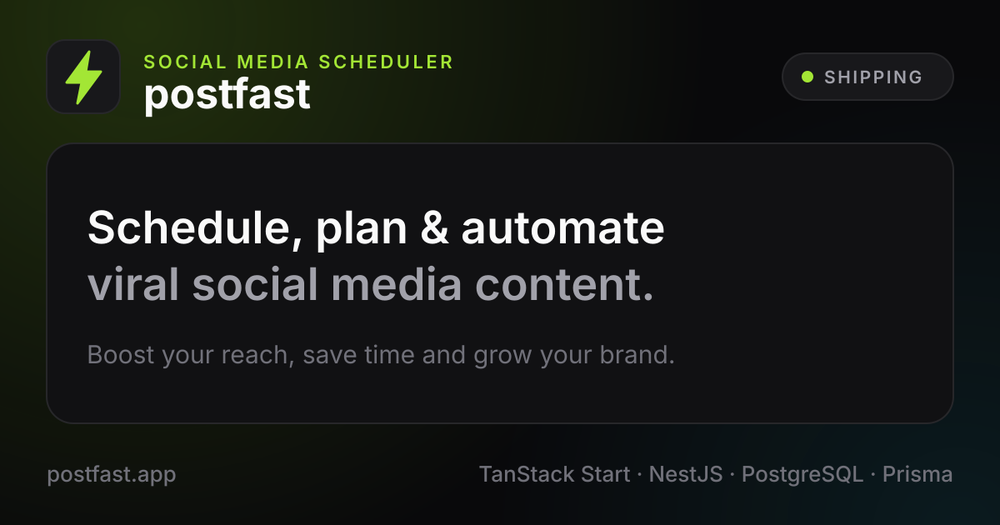
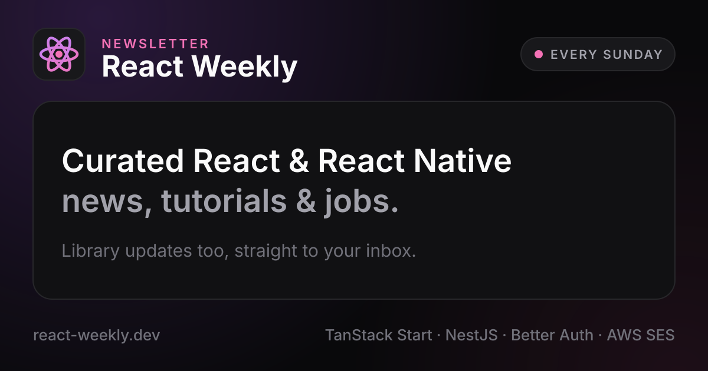
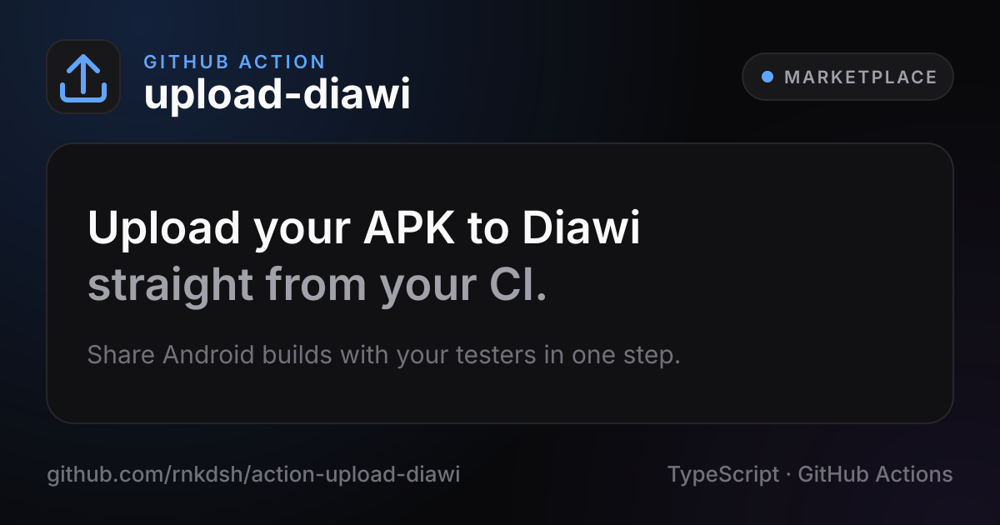

<a href="https://ronakdoshi.in">
  
</a>

<p align="center">
  <a href="https://ronakdoshi.in"></a>
  <a href="https://x.com/rnkdsh"></a>
  <a href="https://www.linkedin.com/in/rnkdsh"></a>
  <a href="https://www.youtube.com/@ronakdoshi"></a>
  <a href="mailto:ronakdoshi10@gmail.com"></a>
</p>

### Hey, I'm Ronak 👋

I'm a software engineer from India, shipping apps since 2017. I cut my teeth on **Android** (Kotlin, Java, 21 apps and a healthy obsession with pixel-perfect UI), and these days I build across the stack with **React, Next.js, React Native and Nest.js**. Right now I'm a Software Engineer III at [**Augmented Ally**](https://augmentedally.com).

- 🔭 Building [**postfast**](https://postfast.app) and curating [**React Weekly**](https://react-weekly.dev)
- 🌱 Currently learning… everything 🤣
- 💬 Ask me about React, React Native, Next.js, Nest.js, Android and APIs
- 📫 Want to chat? [DM me on X](https://x.com/rnkdsh) with a direct question. I ignore all soliciting 🙅

### ⚡ Things I've built

<p align="center">
  <a href="https://postfast.app"></a>
  <a href="https://react-weekly.dev"></a>
  <a href="https://yearprogress20xx.app"></a>
  <a href="https://github.com/marketplace/actions/upload-diawi"></a>
</p>

<p align="center"><sub>That Year Progress card isn't a mockup: the app renders it, and a workflow grabs a fresh one every day.</sub></p>

#### 📬 Fresh from React Weekly

<!-- REACT-WEEKLY:START -->
- [Issue #40: React Native Deep Dives and the Road to TanStack Charts](https://react-weekly.dev/newsletter/40) <sub>· Oct 4, 2026</sub>
- [Issue #39: Agentic Workflows and Mobile Ecosystem Updates](https://react-weekly.dev/newsletter/39) <sub>· Sep 27, 2026</sub>
- [Issue #38: React Native Architecture Migrations and Server Functions](https://react-weekly.dev/newsletter/38) <sub>· Sep 20, 2026</sub>

<!-- REACT-WEEKLY:END -->

<sub>Pulled in automatically from the <a href="https://react-weekly.dev/rss.xml">RSS feed</a>. Like what you see? <a href="https://react-weekly.dev">Subscribe for free →</a></sub>

### 🧰 Tools of the trade


Also in the toolbox: React Native, TanStack Start, shadcn/ui and Better Auth. And from the Android days: Kotlin, Java and the Android SDK.

### 🧭 Career, as a git log

```console
$ git log --oneline career
c0ffee42 (HEAD -> career) Software Engineer III @ Augmented Ally · 2023–now
f17a11ab Lead Software Engineer @ Fitness AI Labs · 2023
5ca1ab1e Technical Lead @ TeraMera Labs · 2022–2023
ded1ca7e Android Developer @ Voolsy Networks · 2019–2022
cafebabe (tag: v1.0.0) Android Developer @ Hyperlink Infosystem · 2017–2019
5eed2012 init: B.E. Information Technology @ GTU · 2012–2016
```

<sub>psst: those commit hashes aren't random.</sub>

<details>
<summary><b>🤖 Android roots: 21 apps shipped</b> <sub>(click to expand)</sub></summary>
<br>


| App | What it does |
| :-- | :-- |
| 3Fit | Fitness tracking that helps you hit your goals |
| Trademanza | Learn the stock market through mock trading games, news, lessons and quizzes |
| Stickerry | A huge collection of WhatsApp stickers |
| MsgBook | A huge collection of text messages for every occasion |
| iDoor | Smart-lock app: skip the keys and unlock with your phone or fingerprint |
| [PerDiemz](https://www.zorior.com/us-healthcare-website-app-development) | Nurse staffing network that bridges nurses and healthcare facilities |
| Artio | Discover, collect and monetize art |
| Shaishya Academy | App for a multi-sports academy |
| SHANTI | Grocery shopping for a local region |
| DailyView | Earn a daily bonus for finishing simple daily tasks |
| Insight | The first real estate app in a regional language |
| [Saamell: Buy & Sell](https://www.hyperlinkinfosystem.com/our-portfolio/saamell) | Commission-free buying and selling of new and second-hand stuff |
| [021 Foods](https://www.hyperlinkinfosystem.com/our-portfolio/021foods) | Food and drink ordering |
| [WhatsDeGo](https://www.hyperlinkinfosystem.com/our-portfolio/whatsdego) | Meet new people at popular cafés and restaurants |
| [Bedaati](https://www.hyperlinkinfosystem.com/our-portfolio/bedaati) | On-demand app for getting goods to beneficiaries quickly |
| Indic Reader | Read Indian languages on phones that don't support them |
| GTU Result | Check university results and get notified the moment new ones are out |
| [Saved WiFi Passwords](https://play.google.com/store/apps/details?id=com.wifipasswords.rnkdsh) | See the passwords of your saved Wi-Fi networks (still live on Google Play) |
| Gujarati Viewer and Reader | Read Gujarati on phones that don't support it |
| Punjabi Viewer and Reader | Read Punjabi on phones that don't support it |
| Phone Finder | Find your misplaced phone, fast |

<sub>Most of these have since retired from Google Play, so only the ones still online are linked.</sub>

</details>

### 🤝 Open source & community

- 🔀 Merged upstream: [nest-modules/mailer#995](https://github.com/nest-modules/mailer/pull/995) (NestJS 10 support) and [invertase/react-native-google-mobile-ads#261](https://github.com/invertase/react-native-google-mobile-ads/pull/261) (Android and iOS SDK bump)
- 🧠 [trivia-quiz-next](https://github.com/rnkdsh/trivia-quiz-next): a multiple-choice trivia game built with Next.js. [Play it here](https://trivia-quiz-next.vercel.app)
- 🎟️ Spotted at GDG DevFest [2022](https://x.com/rnkdsh/status/1604173617885229057), [2023](https://x.com/rnkdsh/status/1736662546353168860) and [2024](https://x.com/rnkdsh/status/1860564303323234682), [Connect with Google 2023](https://x.com/rnkdsh/status/1688969340488765440) and Google Play's [App Excellence Summit 2017](https://x.com/rnkdsh/status/899210465712025600)

<br>

<picture>
  <source media="(prefers-color-scheme: dark)" srcset="https://raw.githubusercontent.com/rnkdsh/rnkdsh/output/snake-dark.svg">
  <source media="(prefers-color-scheme: light)" srcset="https://raw.githubusercontent.com/rnkdsh/rnkdsh/output/snake.svg">
  
</picture>

<p align="center"><sub>My contribution graph, eaten fresh every day. Most of the green is private work 🤫</sub></p>

<p align="center"><sub><code>~ $ exit</code> · thanks for stopping by 👋</sub></p>
